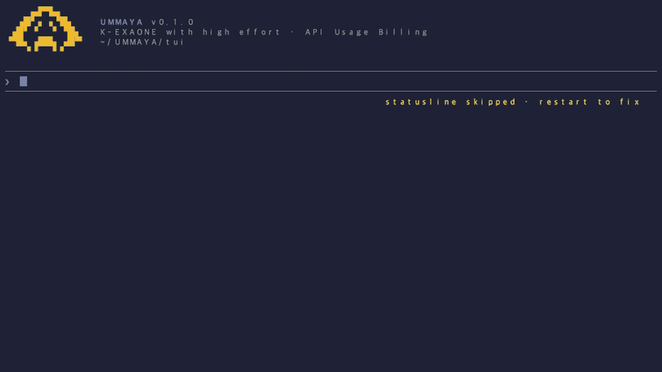
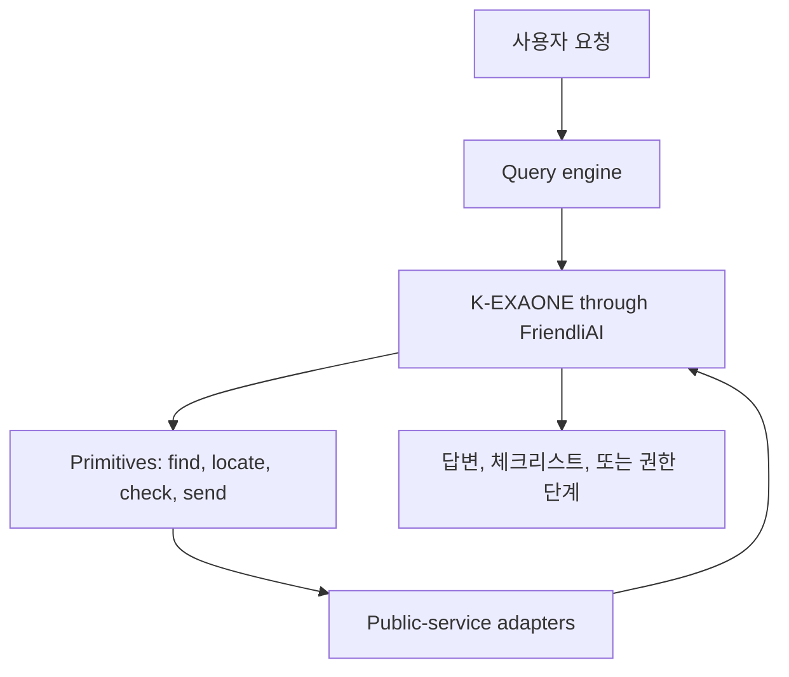

# UMMAYA

[](https://www.npmjs.com/package/ummaya)
[](LICENSE)

**Unified Multi-Ministry Agent for Your Administration.**
읽으면, **엄마야**.

UMMAYA는 한국 공공서비스를 자연어로 다루기 위한 터미널 AI 하네스입니다. 사용자는 포털명이나 기관명을 먼저 알 필요 없이, 원하는 결과를 말합니다. UMMAYA는 FriendliAI로 서빙되는 K-EXAONE이 공공서비스 어댑터를 추론하고 `find`, `locate`, `check`, `send` 네 가지 primitive를 사용하도록 연결합니다.

```bash
curl -fsSL https://raw.githubusercontent.com/umyunsang/UMMAYA/main/install.sh | bash && ummaya
```

실행 후 `/login`을 입력하고 FriendliAI API 키를 넣으면 됩니다. 공개 CLI 사용자는 Kakao, data.go.kr, JUSO, SGIS 키를 따로 설정하지 않습니다. 라이브 공공 API 자격 증명은 패키지의 gateway 경로에서 운영자 관리 방식으로 처리합니다.

> UMMAYA는 학술 및 연구개발 목적의 프로젝트입니다. Anthropic, LG AI Research, FriendliAI, 대한민국 정부 또는 특정 공공기관과 공식 제휴된 서비스가 아닙니다.

## 데모 보기

<a href="assets/ummaya-demo.mp4">
  
</a>

<sub>데모를 클릭하면 MP4로 볼 수 있습니다. 이 영상은 실제 `ummaya` 터미널 세션을 `t-rec`으로 녹화한 결과입니다. 긴 대기 구간만 편집했고, 프롬프트, UI, 답변, 도구 호출은 합성하지 않았습니다.</sub>

## 왜 만들었나

시민은 부처명, 포털명, API 이름으로 생각하지 않습니다.

보통 이렇게 말합니다.

```text
동아대 승학캠퍼스에서 친구가 갑자기 아프면 지금 바로 연락할 응급실 어디가 가까워?
```

또는 이렇게 말합니다.

```text
이사했어. 전입신고하고 자동차, 건강보험, 학교 관련 주소도 한 번에 바꿔줘.
```

대부분의 디지털 공공서비스는 이미 존재합니다. 하지만 사용자는 여전히 어느 포털이 어떤 단계를 담당하는지 알아야 합니다. UMMAYA는 다른 형태를 실험합니다. 사용자는 자연어로 요청하고, 하나의 agentic loop가 여러 공공서비스 채널을 찾아 순서대로 사용합니다.

## 무엇을 하나

| 사용자가 필요한 것 | UMMAYA가 시도하는 일 |
|---|---|
| 공공 정보 찾기 | `find`로 라이브 또는 문서화된 공공서비스 어댑터를 검색합니다 |
| 장소 이해하기 | `locate`로 주소, 좌표, 행정구역을 해석합니다 |
| 본인확인 또는 조건 확인 | `check` 전에 사용자에게 명시적 권한을 요청합니다 |
| 제출 흐름 준비 | `send`로 안전한 제출 또는 공식 채널 handoff 흐름을 구성합니다 |

UMMAYA는 도구 목록을 광고하는 프로젝트가 아닙니다. 모델이 대화 중 필요한 도구를 선택하고, 터미널은 각 도구 호출을 분리해서 보여줍니다. 사용자는 어떤 순서로 조회, 위치 해석, 확인, 제출이 이어지는지 볼 수 있습니다.

## 이렇게 물어보세요

아래 문장은 기능 테스트가 아니라 실제 사용자가 할 법한 요청으로 썼습니다.

| 상황 | 프롬프트 |
|---|---|
| 다대포 날씨 | `퇴근하고 다대포해수욕장 산책 가도 괜찮을까? 지금 기온이랑 비 오는지만 빠르게 확인해줘.` |
| 동아대 근처 응급실 | `동아대 승학캠퍼스에서 친구가 갑자기 아프면 지금 바로 연락할 응급실 어디가 가까워? 찾아진 곳만 이름, 주소, 전화번호로 알려줘.` |
| 다대1동 근처 병원 | `다대1동에서 오늘 전화해볼 수 있는 내과가 있을까? 찾아진 곳만 주소랑 전화번호까지 알려줘.` |
| 이사 | `이사했어. 전입신고하고 자동차, 건강보험, 학교 관련 주소도 뭐부터 확인해야 하는지 알려줘.` |
| 개인정보 정정 | `정부기관들이 내 정보를 어디에 쓰고 있는지 확인하고 잘못된 주소나 연락처는 고쳐줘.` |

## 빠른 설치

macOS 권장 설치:

```bash
curl -fsSL https://raw.githubusercontent.com/umyunsang/UMMAYA/main/install.sh | bash && ummaya
```

Homebrew로 직접 설치:

```bash
brew tap umyunsang/ummaya && brew install --cask ummaya && ummaya
```

npm 대체 설치:

```bash
npm install -g ummaya && ummaya
```

Homebrew 경로는 패키지 CLI가 쓰는 런타임 의존성을 함께 설치합니다. npm 경로는 Bun `>=1.3.0`과 `uv`가 로컬에 준비되어 있어야 합니다.

## 처음 실행

1. UMMAYA를 실행합니다.

   ```bash
   ummaya
   ```

2. 로그인합니다.

   ```text
   /login
   ```

3. FriendliAI API 키를 붙여 넣습니다.

4. 자연어로 요청합니다.

   ```text
   다대1동에서 오늘 전화해볼 수 있는 내과가 있을까? 찾아진 곳만 주소랑 전화번호까지 알려줘.
   ```

## 작동 방식



UMMAYA는 Claude Code 스타일의 agent harness를 한국 공공서비스 도메인으로 옮깁니다.

- Query engine은 요청이 해결되거나, 막히거나, 사용자 입력이 필요할 때까지 대화 루프를 유지합니다.
- LLM-visible 도구 표면은 `find`, `locate`, `check`, `send` 네 개로 유지합니다.
- 어댑터는 기관별 wire format을 typed envelope와 JSON Schema 뒤로 감춥니다.
- 권한 프롬프트는 본인확인, 개인정보, 되돌리기 어려운 절차를 보호합니다.
- 긴 도구 결과는 TUI에서 축약하고, 자세히 볼 때는 `ctrl+o`로 확장합니다.

아키텍처 논지는 [docs/vision.md](docs/vision.md)를 참고하세요.

## 현재 릴리스의 경계

UMMAYA는 공식 접근 권한 없이 보호된 정부 업무를 완료한다고 주장하지 않습니다.

현재 공개 릴리스는 다음에 집중합니다.

- 설치 가능한 터미널 CLI
- 어댑터가 준비된 라이브 공공 정보 및 위치 조회
- 공식 기관 승인이 필요한 보호 도메인의 mock 또는 fixture 기반 흐름
- 공공기관, civic-tech 팀, 연구자가 검토할 수 있는 plugin 및 adapter 구조

정부24 제출, 본인확인, 증명서, 납부, 세금 신고, 복지 신청, 개인정보 정정처럼 보호된 업무는 공식 접근 경로가 필요합니다. 그 접근이 없을 때 UMMAYA는 안전한 시뮬레이션, 체크리스트, receipt 형태의 evidence, 또는 공식 채널 handoff에서 멈춰야 합니다.

## 개발자와 파트너를 위해

확장하거나 검토할 때는 아래 문서를 먼저 보세요.

- [docs/api](docs/api/) - 활성 어댑터 계약과 스키마
- [docs/plugins](docs/plugins/) - plugin architecture와 security review
- [docs/configuration.md](docs/configuration.md) - 환경변수 registry
- [docs/demo](docs/demo/) - 실제 t-rec README 데모 파이프라인
- [docs/vision.md](docs/vision.md) - 플랫폼 비전과 harness thesis
- [CONTRIBUTING.md](CONTRIBUTING.md) - 기여 workflow

## 모델과 라이선스

UMMAYA는 현재 LLM 응답에 FriendliAI를 통한 [K-EXAONE-236B-A23B](https://huggingface.co/LGAI-EXAONE/K-EXAONE-236B-A23B)를 사용합니다.

- 모델: `LGAI-EXAONE/K-EXAONE-236B-A23B`
- 추론 채널: `UMMAYA_K_EXAONE_THINKING` default `false` (답변이 사용자에게 보이는 content channel로 바로 오도록 하는 현재 릴리스 기본값)
- 모델 라이선스: [K-EXAONE AI Model License Agreement](https://huggingface.co/LGAI-EXAONE/K-EXAONE-236B-A23B/blob/main/LICENSE)
- 프로젝트 라이선스: [Apache License 2.0](LICENSE)

모델 라이선스는 UMMAYA 소스코드 라이선스와 별개입니다. UMMAYA는 LG AI Research, FriendliAI, Hugging Face, 대한민국 정부 또는 공공기관 자산에 대한 권리를 부여하지 않습니다.

## 상태

UMMAYA는 alpha 단계의 학생 포트폴리오이자 학술 R&D 프로젝트입니다. 이슈, 시나리오 아이디어, 문서 개선, 어댑터 제안은 [GitHub Issues](https://github.com/umyunsang/UMMAYA/issues)와 [Discussions](https://github.com/umyunsang/UMMAYA/discussions)에서 받을 수 있습니다.
