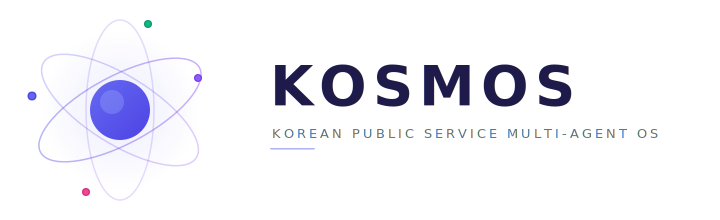

<picture>
  <source media="(prefers-color-scheme: dark)" srcset="assets/kosmos-banner-dark.svg"/>
  <source media="(prefers-color-scheme: light)" srcset="assets/kosmos-banner-light.svg"/>
  
</picture>

# KOSMOS

**KO**rea public **S**erivce **M**ulti-agent **O**rchestration **S**ystem

A conversational national-infrastructure AI agent platform that orchestrates Korean public OpenAPIs (data.go.kr) through a multi-agent architecture inspired by Claude Code's internal patterns, powered by LG AI Research's K-EXAONE.

> Academic R&D project. Not affiliated with Anthropic, LG AI Research, or the Korean government.

## Vision

Turn the 5,000+ fragmented public APIs on data.go.kr into a single conversational interface where citizens can resolve cross-ministry civil affairs (민원) in natural language — route safety, emergency services, welfare benefits, residence transfer, and more.

## Architecture

KOSMOS transfers six architectural layers from Claude Code into the public-service domain:

| Layer | Claude Code Origin | KOSMOS Adaptation |
|---|---|---|
| **Query Engine** | `while(true)` tool loop + 5-stage preprocessing | Civil-affairs state machine with ministry routing |
| **Tool System** | `buildTool()` factory + Partition-Sort cache strategy | `buildGovAPI()` adapters for data.go.kr endpoints |
| **Permission Pipeline** | 7-step gauntlet with bypass-immune checks | Citizen authentication + PII protection layers |
| **Agent Swarms** | File-based mailbox IPC + Coordinator synthesis | Ministry-specialist agents over message queue |
| **Context Assembly** | CLAUDE.md 6-tier memory + per-turn attachments | `CITIZEN.md` profile + live API status attachments |
| **Error Recovery** | `withRetry` with 429/529/401 matrix | Public-API outage fallback + cross-ministry verification |

## Model Stack

- **Orchestrator** — K-EXAONE 236B (reasoning mode) for multi-agent synthesis and long-context civil-affairs flows
- **Workers** — EXAONE 4.5 33B (non-reasoning) for single API calls, OCR, and fast response
- **Router / Classifier** — EXAONE 4.0 1.2B for intent classification and ministry routing

## Roadmap

- **Phase 1 — Prototype (3 months)** — FriendliAI Serverless + 10 high-value APIs + single query engine
- **Phase 2 — Swarm (6 months)** — Ministry agents, mailbox IPC, multi-API synthesis
- **Phase 3 — Production (12 months)** — Full permission pipeline, identity verification, audit logging

## Status

Early initialization. Architecture design in progress.

## Contributing

Contributions are very welcome — issues, design discussions, tool adapters, and documentation. Start with:

- [CONTRIBUTING.md](CONTRIBUTING.md) — workflow, branch and commit conventions, coding standards
- [CODE_OF_CONDUCT.md](CODE_OF_CONDUCT.md) — Contributor Covenant 2.1
- [SECURITY.md](SECURITY.md) — private vulnerability reporting
- [CHANGELOG.md](CHANGELOG.md) — release history

For questions or design proposals, open a [Discussion](https://github.com/umyunsang/KOSMOS/discussions) before writing code on large ideas.

## License

Licensed under the [Apache License 2.0](LICENSE). By contributing, you agree that your contributions will be licensed under the same terms.
