# KOSMOS

> **K**orean **O**pen **S**ervices **M**ulti-agent **O**rchestration **S**ystem
>
> 5,000+ 정부 공공 API를 단일 대화형 인터페이스로 통합하는 학생 포트폴리오 프로젝트
>
> **Target**: KSC 2026 · **License**: Apache-2.0 · **Stack**: Python 3.12 + FriendliAI K-EXAONE + Ink TUI

---

## 1. 무엇을 만드는가

`data.go.kr`에 흩어진 5,000여 개의 정부 API를 시민이 자연어로 한 번에 질의할 수 있는 대화형 멀티에이전트 플랫폼.

```text
시민:   "내일 부산에서 서울 가는데, 안전한 경로 추천해줘"
KOSMOS: KOROAD 사고 데이터 + KMA 기상특보 + 도로 위험 지수 융합
        → "경부고속도로 대전-천안 구간 위험 등급, 안개 주의보.
           중부내륙 우회를 추천합니다."

시민:   "아이가 열이 나는데 근처 야간 응급실 어디야?"
KOSMOS: 119 응급의료 API + HIRA 병원정보 융합
        → 위치순 가용 응급실 + 현재 대기시간

시민:   "출산 보조금 신청하고 싶은데"
KOSMOS: 보건복지부 자격조회 API + Gov24 신청 API
        → 자격 확인, 필요 서류, 온라인 신청 가이드
```

시민은 어느 부처가 어떤 API를 운영하는지 학습하지 않습니다. **라우팅은 KOSMOS가 합니다.**

---

## 1.5. 정책 정합성 — 대한민국 AI 행동계획 2026-2028

KOSMOS의 미션은 학생이 임의로 설정한 것이 아니라, 국가 차원의 공공AX 정책 방향과 직접 정합합니다. 아래 인용은 모두 **국가인공지능전략위원회, 『대한민국 인공지능 행동계획』, 2026.2.25** 에서 발췌했습니다.

### Flagship 정합 — Open API · OpenMCP (KOSMOS 미션과 1:1)

> "Open API와 OpenMCP를 제공해 민간에서도 공공서비스를 손쉽게 결합해서 국민들에게 제공할 수 있어야 한다. 이를 위해 Open API와 OpenMCP 표준 가이드라인을 작성한다."
>
> — 국가인공지능전략위원회, 『대한민국 인공지능 행동계획』, 2026.2.25, p.97 (전략분야 7 공공AX, 과제 58 — 원칙 9)

KOSMOS는 바로 이 "민간에서 공공서비스를 결합해 국민에게 제공" 의 학생 레퍼런스 구현입니다.

### AI-Native 정부 비전

> "모든 행정·공공서비스를 데이터와 인공지능 기반으로 재설계해 세계 최고의 AI 기반(이하 'AI-Native') 정부를 만들어 … 국민 삶의 질, 행정의 효율과 신뢰를 세계 최고 수준으로 끌어올린다."
>
> — 국가인공지능전략위원회, 『대한민국 인공지능 행동계획』, 2026.2.25, p.85 (전략분야 7 공공AX 비전)

### Citizen Scenarios 근거 — 단일창구·무서면·단일ID

> "정부의 모든 서비스는 하나의 아이디로 쓸 수 있다."
>
> — 같은 자료, p.96, 원칙 1

> "정부가 보유한 어떤 서류도 국민에게 서면 제출을 요구하지 않으며, 이는 열람승인으로 모두 대체한다."
>
> — 같은 자료, p.96, 원칙 5

> "모든 민원을 AI를 활용해 단일창구로 접수/처리하고, 국민은 신속히 결과를 제공받는다."
>
> — 같은 자료, p.96, 원칙 8

이 세 원칙이 §7 Citizen Scenarios(이사·응급·출산보조금 등)의 정책적 근거입니다. 특히 원칙 5(서면 → 열람승인) 는 §4 Permission Pipeline 의 read-only 기본값과 본인인증 게이트의 직접 정당화입니다.

### Permission Pipeline 정당화 — AI 에이전트 위험 차단

> "AI 에이전트의 오작동·권한 오남용·정책 우회 위험을 체계적으로 차단한다."
>
> — 같은 자료, p.14-15 (전략분야 1 — AI 안전·신뢰)

§4 의 **bypass-immune 7단계 게이트**, §3 의 classifier 분리(prose 미노출), §5 의 **워커 권한 측면 전이 금지** 모두 이 원칙의 구현입니다.

### 포용적 AI 기본사회 — 시민 형평성

> "모두가 AI의 혜택을 누리고, 기술 발전이 곧 포용적 사회를 향한 발전의 동력이 되는 'AI 기본사회'를 실현한다."
>
> — 같은 자료, p.133 (전략분야 11 AI 기본사회 비전)

> "나이·직업·지역·계층에 관계없이 모든 국민이 AI를 이해·활용하는 포용적 디지털 역량 사회를 구현한다."
>
> — 같은 자료, p.133

KOSMOS의 자연어 단일 인터페이스(어느 부처·어느 API 인지 학습 불요)는 이 포용성 목표의 직접 응답입니다.

### 중복투자 회피 — 공통 인프라

> "필요한 AI플랫폼은 범정부 공통 AI인프라를 활용함으로써 중복투자를 막고 효율을 높인다."
>
> — 같은 자료, p.97, 원칙 11

§5 Agent Swarm 의 공유 tool registry · 단일 LLM 게이트웨이 · prompt cache partitioning 설계는 이 원칙의 마이크로 스케일 적용입니다.

> **출처 표기 원칙**: 본 발표자료의 모든 인용은 발행처(국가인공지능전략위원회), 자료명(『대한민국 인공지능 행동계획』), 발행일(2026.2.25), 페이지 번호를 명시했습니다. KOSMOS는 정부 공식 산출물이 아니며, 본 인용은 학술·교육 목적의 정책 정합성 검증을 위한 인용입니다.

---

## 2. 6-Layer Architecture — 전체 구조



시민이 **L1 Query Engine**으로 자연어 질의를 보내면, 도구 호출(L2) → 권한 검증(L3)을 거쳐 `data.go.kr` API로 나가고, L4(에이전트 스폰)·L5(컨텍스트 주입)는 비동기로 L1과 양방향 통신합니다. **LLM**은 매 턴마다 L1이 호출하는 별도 하단 엔진입니다.

| # | Layer | 역할 | 패턴 계보 |
|---|---|---|---|
| 1 | **Query Engine** | 시민 민원을 해소할 때까지 도는 `while(True)` 도구 루프 | Async generator state machine |
| 2 | **Tool System** | `data.go.kr` API 어댑터 레지스트리 + 팩토리 | Schema-driven tool modules |
| 3 | **Permission Pipeline** | 시민 인증 + 개인정보 보호 게이트 | Multi-step bypass-immune gauntlet |
| 4 | **Agent Swarms** | 부처 전문 에이전트 + 코디네이터 | Mailbox IPC + coordinator synthesis |
| 5 | **Context Assembly** | 매 턴 LLM이 보는 3단 컨텍스트 | System + memory + attachments |
| 6 | **Error Recovery** | 공공 API 장애·점검·쿼터 회복 | `withRetry` 매트릭스 |

---

## 3. Layer 1 — Query Engine 순환 루프



Query Engine은 4단계 순환 루프(Pre-process → LLM Call → Post-process → Decide)로 동작합니다. `tool_use`면 ①로 재진입, `end_turn`이면 5가지 종료 조건 중 하나로 빠져나갑니다. 중앙의 **QueryState**가 세션·메시지·에이전트·사용량 등 전체 상태를 관리하고, `yield` 이벤트로 caller에게 실시간 스트리밍합니다.

### 핵심 설계 결정 3가지

1. **Async generator를 통신 프로토콜로** — 콜백·이벤트 버스 없음. `yield`로 진행 이벤트를 흘리면 caller가 자기 속도로 소비(backpressure). 시민이 "취소"를 누르면 cancellation이 모든 in-flight API 호출에 자연 전파.
2. **Mutable history + immutable per-call snapshots** — 대화 리스트는 in-place로 늘어나지만, LLM 호출에는 immutable copy 전달. **prompt cache를 살리는 가장 중요한 트릭** — 도구 응답마다 cache invalidate되면 비용이 폭증함.
3. **Multi-stage preprocessing** — `tool-result budget → snip → microcompact → collapse → autocompact`. 이사 + 차량 주소 + 건강보험 변경을 한 세션에 처리하면 컨텍스트 윈도가 금방 터짐.

### 종료 조건 5가지

```text
StopReason:
  task_complete           # 민원 해소
  needs_citizen_input     # 추가 확인 필요
  needs_authentication    # 본인인증 필요
  api_budget_exceeded     # 일일 쿼터 소진
  error_unrecoverable     # 회복 불가
```

---

## 4. Layer 3 — Permission Pipeline 7단계 게이트



모든 tool call이 **반드시 통과**해야 하는 7단계 순차 게이트. 차단 시 빨간 점선으로 **Refusal Circuit Breaker**에 집계되고, N회 연속 차단 시 콜센터/방문 등 **Human Channel**로 라우팅됩니다.

| # | 게이트 | 검사 항목 |
|---|---|---|
| 1 | Configuration | API별 접근 등급(public/authenticated/restricted) |
| 2 | Intent Analysis | 자연어 요청이 이 도구 호출을 정당화하는가 |
| 3 | Parameter Inspection | 인자에 시민이 조회 권한 없는 PII가 들어있는가 |
| 4 | **Citizen Authentication** | 요구되는 본인인증 레벨이 충족되었는가 ⛔ bypass-immune |
| 5 | Ministry Terms-of-Use | 부처별 데이터 이용약관 동의 여부 |
| 6 | Sandboxed Execution | 격리된 컨텍스트에서 ambient credential 없이 실행 |
| 7 | Audit Log | 시각·시민ID·API·인자·결과 전부 기록 |

### Bypass-immune 원칙

다음 검사들은 **어떤 모드(자동화/관리자/YOLO)로도 우회 불가**:
- 타인의 개인정보 조회
- 명시적 동의 없는 의료기록 접근
- 본인인증 레벨 미충족 상태의 쓰기 작업(신청·수정·취소)

### Classifier 분리

LLM 기반 의도 위험도 분류기는 **제안된 tool call과 인자만** 보고, 어시스턴트 자신의 정당화 산문(prose)은 **절대 보지 못함**. 모델이 분류기를 설득해 통과시키는 경로 차단.

---

## 5. Layer 4 — Agent Swarm: 이사 시나리오



다부처 요청은 단일 모놀리식 에이전트로 부족합니다. KOSMOS는 **코디네이터-워커 swarm**을 사용합니다.

```text
시민: "이사 준비 중인데, 전입신고랑 자동차 주소변경이랑
      건강보험 주소변경 다 해야 하는데"

Coordinator:
  Research (병렬 워커):
    ├─ 민원24 에이전트  → Gov24 전입신고 요건
    ├─ 교통 에이전트    → 자동차 등록 주소 변경
    └─ 복지 에이전트    → 건강보험 주소 변경

  Synthesis (코디네이터 독점, 위임 금지):
    "셋 다 전입신고가 선행되어야 함.
     이후 자동차·건강보험은 병렬 가능."

  Implementation:
    Step 1: 전입신고 (순차 — prerequisite)
    Step 2: 자동차 + 건강보험 (병렬 — independent)

  Verification (병렬):
    └─ 각 트랜잭션 성공 확인
```

### 두 가지 강제 원칙

- **Coordinator owns synthesis** — 워커는 raw findings만 반환. 통합·계획은 코디네이터 독점.
- **Permission never flows laterally** — 워커가 권한이 부족하면 `permission_request`를 코디네이터로 올려 시민에게 묻고, 받은 자격증명을 다시 워커로 내려보냄. 워커-워커 직접 통신 금지.

### Mailbox IPC

워커-코디네이터 통신은 in-process callback이 아니라 **durable mailbox**. 초기엔 파일 기반 mailbox로 단순하게, production은 Redis Streams로 마이그레이션. 동일 인터페이스 유지.

이유: 프로세스 간 통신, 크래시 복원력(메시지 잔존), 디버깅 용이성(mailbox 직접 inspect), 소규모에서 service discovery 불필요.

---

## 6. Layer 6 — Error Recovery 매트릭스

```text
Public API call → error?
  ├── 429 Rate limited     → exponential backoff (base 1s, cap 60s)
  ├── 503 Maintenance      → 대체 API 검색 → 없으면 시민에게 안내
  ├── 401 Auth expired     → 토큰 갱신 후 1회 retry
  ├── Timeout              → ×3 재시도, 캐시 결과로 fallback
  ├── Data inconsistency   → 다른 부처 API와 cross-verify
  └── Hard failure         → graceful 메시지 + 방문 서비스 안내
```

**Foreground vs background**: 시민이 응답 대기 중인 foreground는 적극 retry, 통계·자동메모리 정리 같은 background는 fail-fast.

---

## 7. Citizen Scenarios — 합격 기준

플랫폼이 다음 5가지를 end-to-end로 처리하지 못하면 비전 미달성:

1. **Route safety** — `KOROAD + KMA + 도로 위험` → 안전 경로 추천
2. **Emergency care** — `119 + HIRA` → 가용 응급실 랭킹
3. **Childbirth benefits** — `MOHW 자격 + Gov24 신청` → 자격 확인 + 신청 가이드
4. **Residence transfer** — `Gov24 + 자동차등록 + 건강보험` 조율
5. **Disaster response** — `KMA + NEMA + 지자체 공지` 통합

---

## 8. KOSMOS만의 차별점

오픈소스 코딩 에이전트(Claude Code, Gemini CLI, Aider …)에서는 발생하지 않는 **공공 도메인 고유 제약**:

- **Bilingual tool discovery** — 5,000+ 이종 스키마의 정부 API에서 한·영 동시 검색
- **Bypass-immune permission pipeline** — 시민 PII 보호 (PIPA 준거, 개발자 편의 아님)
- **Multi-ministry coordination** — 의존 순서가 **법령으로 결정됨** (예: 전입신고 → 자동차 주소변경)
- **Prompt cache partitioning** — 세금으로 운영되는 공공 AI 비용 최적화
- **Fail-closed adapters** — 안전한 기본값은 deny, allow 아님

---

## 9. 인프라 설계 — 2026 LLM-Agent Production-Grade

Phase 1(CLI MVP) 완료 직후 **Infra Initiative**(GitHub #462) 6개 Epic 병렬 진행:

| Epic | 영역 | 핵심 도구 |
|---|---|---|
| #463 | **Observability** | OpenTelemetry GenAI semconv + Langfuse self-host |
| #464 | **Evals & Regression** | Promptfoo PR gate + DeepEval pytest-style |
| #465 | **Cost & LLM Gateway** | LiteLLM Proxy + per-session budget |
| #466 | **Safety Rails** | Presidio PII + Guardrails AI + indirect-injection 방어 |
| #467 | **CI/CD & Prompt Registry** | uv Docker + prompt manifest + shadow/canary |
| #468 | **Secrets & Config** | Infisical OIDC + 12-factor cleanup |

근거: OWASP LLM Top 10 2026, "Bypassing Guardrails" arXiv 2504.11168, Snyk 2025년 GitHub 자격증명 누출 28M건 보고서.

---

## 10. Roadmap

- **Phase 1 — Prototype** ✅ — FriendliAI Serverless + 10개 고가치 API + 단일 query engine + CLI. Scenario 1 end-to-end 작동 (live 33/33 pass)
- **Phase 2 — Swarm** — 부처 전문 에이전트, mailbox IPC, 다중 API 합성. Scenarios 1–3
- **Phase 3 — Production** — 전체 권한 파이프라인, 본인인증, 감사 로그, 전 시나리오, 공개 베타

### Code Scope Estimate

| Layer | LOC |
|---|---|
| Query Engine | ~5,000 |
| Tool System | ~2,000 + N adapters |
| Permission Pipeline | ~6,000 |
| Agent Swarms | ~8,000 |
| Context Assembly | ~5,000 |
| Error Recovery | ~3,000 |
| **Total core** | **~30,000** |

---

## 11. References

플랫폼은 다음 오픈소스·문서·재구성 분석을 적극 참조:

| 출처 | 라이선스 | 적용 |
|---|---|---|
| Claude Agent SDK | MIT | Async generator tool loop, permission types |
| OpenAI Agents SDK | MIT | Guardrail pipeline, retry matrix |
| Pydantic AI | MIT | Schema-driven tool registry, graph state machine |
| AutoGen (Microsoft) | MIT | AgentRuntime mailbox IPC, InterventionHandler |
| Anthropic Cookbook | MIT | Orchestrator-workers 패턴 |
| Gemini CLI (Google) | Apache-2.0 | Ink + React + Yoga TUI 전체 구현 |
| Claude Code sourcemap | Reconstructed | 도구 루프 내부, 권한 모델, 컨텍스트 조립 |
| PublicDataReader | MIT | `data.go.kr` 와이어 포맷 ground truth |
| NeMo Guardrails (NVIDIA) | Apache-2.0 | Colang 2.0 — PIPA 준거 가능한 정책 언어 |
| Google ADK | Apache-2.0 | Runner-level plugin, reflect-and-retry |
| LangGraph | MIT | `RetryPolicy`, `ToolNode(handle_tool_errors=True)` |
| stamina / aiobreaker | MIT | Async retry + circuit breaker (L6) |
| arXiv 2601.06007 | Open access | "Don't Break the Cache" — 30–50+ tool-call에서 41–80% 비용 절감 |

전체 목록: [`docs/vision.md § Reference materials`](vision.md#reference-materials)

---

## 12. Non-goals — 무엇이 아닌가

- **범용 코딩 에이전트가 아님** — 파일 편집·셸 명령 실행 없음
- **정부 공식 서비스가 아님** — 공공 데이터를 소비할 뿐, 공식 권위 주장 없음
- **단일 API 챗봇 래퍼가 아님** — 챗봇 래퍼는 6개 레이어가 필요 없음

---

> **Source of truth**: [`docs/vision.md`](vision.md) · **Operational rules**: [`AGENTS.md`](../AGENTS.md)
> **License**: Apache-2.0 · **Repo**: github.com/umyunsang/KOSMOS
