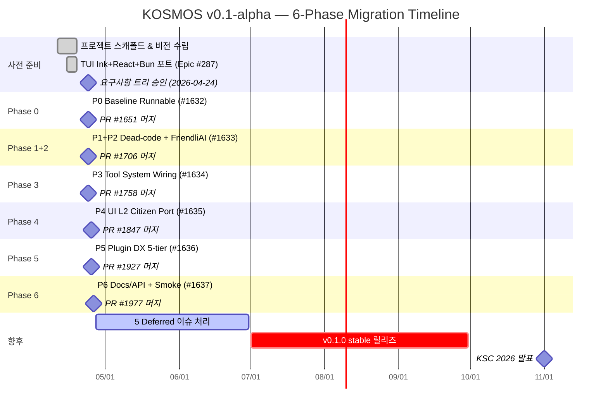

# Chapter 6 — 프로젝트 관리 및 일정

> KOSMOS v0.1-alpha · KSC 2026 발표 자료

---

## 6.1 방법론

KOSMOS는 모든 비자명한 기능을 **Spec-driven Workflow**로 개발했다. GitHub Spec Kit이 제공하는
`/speckit-specify → /speckit-plan → /speckit-tasks → /speckit-analyze → /speckit-taskstoissues → /speckit-implement`
6단계 사이클을 각 Epic마다 완전 이행했고, 단계 산출물(spec.md / plan.md / tasks.md)은 `specs/` 디렉터리에
버전 관리된다. 41개의 spec 디렉터리가 이 관리 원칙의 증거다.

**커밋·브랜치 규범** — Conventional Commits(`feat/fix/docs/refactor/test/chore/ci/style`) +
`feat/`, `fix/`, `docs/` 등의 기능 브랜치를 사용했다. 총 189 커밋, 79 PR 머지.

**Agent Teams** — Lead(Opus)가 계획·리뷰·아키텍처를 담당하고, Teammates(Sonnet)가 구현·테스트를
병렬 수행했다. 3개 이상의 독립 Task가 존재할 때는 `/speckit-implement`에서 Agent Teams를 병렬 dispatch
했다.

**이슈 계층** — Initiative → Epic → Task(GitHub Sub-Issues API v2). Epic당 Task 최대 90개 예산.
6개 마이그레이션 Epic의 전체 Task는 총 44 Task + 5 Deferred(합계 49 서브이슈).

**거버넌스 도구**

| 도구 | 역할 |
|------|------|
| GitHub Spec Kit (`.specify/`) | spec → plan → tasks → analyze 사이클 자동화 |
| Constitution 6 Principles | 아키텍처 원칙 준수 검증 (spec analyze 단계) |
| Copilot Review Gate | Cloudflare Worker → Check Run · CRITICAL ≥ 1 실패 |
| Codex Review | 추가 인라인 리뷰 (PR당 병행) |
| `KOSMOS_*` 환경 변수 | 모든 비밀값은 `.env`에 격리, git 미포함 |
| `uv run pytest` | 커밋 전 전체 테스트 실행 의무 |

---

## 6.2 Phase 일정

### 전체 타임라인 개요

| Phase | 설명 | 시작 | PR 머지 | 소요 |
|-------|------|------|---------|------|
| P0 | Baseline Runnable (CC 2.1.88 포트) | 2026-04-24 | 2026-04-24 04:26 UTC | ~1일 |
| P1+P2 | Dead-code + Anthropic→FriendliAI 마이그레이션 | 2026-04-24 | 2026-04-24 07:51 UTC | ~3시간 |
| P3 | Tool system wiring (4 primitive + stdio MCP) | 2026-04-24 | 2026-04-24 17:00 UTC | ~9시간 |
| P4 | UI L2 citizen port (Onboarding/REPL/Permission/Agents) | 2026-04-25 | 2026-04-25 11:38 UTC | ~20시간 |
| P5 | Plugin DX 5-tier (Template/Guide/Examples/Submission/Registry) | 2026-04-25 | 2026-04-25 19:47 UTC | ~22시간 |
| P6 | Docs/API specs + Integration smoke | 2026-04-26 | 2026-04-26 01:26 UTC | ~20시간 |

> 참고: 각 Phase의 시작일은 해당 Epic의 첫 spec 커밋 날짜 기준.
> 종료일은 Epic을 닫은 PR의 GitHub merge 타임스탬프 기준. 모두 UTC.

### Gantt 차트

> Mermaid Gantt 소스. Visual Storyteller가 SVG로 변환 예정.
> 단일 일자로 표시된 Phase(P0~P6)는 실제 UTC 시간 기준 수 시간~1일 내 완료.

---

## 6.3 정량 통계

| 지표 | 수치 | 비고 |
|------|------|------|
| **프로젝트 시작** | 2026-04-11 | Initial commit (scaffold) |
| **v0.1-alpha 완료** | 2026-04-26 | PR #1977 merge |
| **총 개발 기간** | 15일 | 2026-04-11 ~ 2026-04-26 |
| **집중 마이그레이션 기간** | 3일 | 2026-04-24 ~ 2026-04-26 (P0~P6) |
| **총 커밋 수** | 189 | `git rev-list --count main` |
| **총 PR 머지 수** | 79 | 6 Phase Epic PR 포함 |
| **Spec 디렉터리 수** | 41 | `specs/` 하위 디렉터리 수 |
| **Python 소스 파일** | 16,498 | `.py` 기준 (테스트 포함) |
| **TypeScript/TSX 파일** | 5,935 | `.ts` + `.tsx` 기준 |
| **Phase Epic 수** | 6 | #1632 ~ #1637 |
| **총 Task 서브이슈** | 44 Task + 5 Deferred | 합계 49개 |
| **요구사항 트리 승인** | 2026-04-24 | `docs/requirements/kosmos-migration-tree.md` |

**Phase별 커밋 분포**

| Phase | 커밋 수 | 주요 특징 |
|-------|---------|-----------|
| P0 (Baseline) | 7 | CC 2.1.88 컴파일·런타임 복구 |
| P1+P2 (Dead-code + FriendliAI) | 27 | 94개 파일 변경, -25,263 라인 삭제 |
| P3 (Tool system) | 9 | 4 primitive + stdio MCP 13-tool surface |
| P4 (UI L2) | 15 | 51 tasks, 279 tests, 26 surface 검증 |
| P5 (Plugin DX) | 29 | 50-item 검증 매트릭스, PIPA §26 집행 |
| P6 (Docs + Smoke) | 15 | 24 API spec + 25 schema + 19 TUI surface dump |

---

## 6.4 향후 일정

### Deferred 이슈 처리 (5건)

P6 종료 후 open 상태로 남아 있는 Deferred 서브이슈는 다음 개발 사이클에서 처리한다.

| 이슈 | 제목 | 우선순위 |
|------|------|---------|
| #1972 | Full OpenAPI 3.0 spec for /agent-delegation meta-tool | 중 |
| #1973 | Permanent removal of `ministries_for_composite()` API surface | 하 |
| #1974 | Live-mode regression coverage for 12 Live-tier adapters | 상 |
| #1975 | Auto-generated adapter spec stubs from Pydantic docstrings | 중 |
| #1976 | Migration of OPAQUE mock stubs into docs/scenarios/ shape-mirror entries | 하 |

### 로드맵

| 마일스톤 | 목표 시기 | 주요 내용 |
|---------|----------|-----------|
| 5 Deferred 처리 완료 | 2026 Q2 말 | #1972~#1976 순서대로 spec 사이클 처리 |
| Live API 통합 확대 | FriendliAI Tier 2 승급 시 | 12개 Live-tier 어댑터 실 트래픽 검증 |
| v0.1.0 stable 릴리즈 | 2026 Q3 | smoke 완전 통과 + Live-mode 회귀 커버리지 확보 후 |
| KSC 2026 발표 | 2026 하반기 | 학술 논문 제출 + 시연 |
| P7 (예비) — 국제화·접근성 | 2026 Q4 | 일본어 지원(UI-A.3) + Phase 2 보조 도구 5종 |

---

## 6.5 협업 도구

| 범주 | 도구 | 용도 |
|------|------|------|
| **이슈 관리** | GitHub Issues + Sub-Issues API v2 | Initiative → Epic → Task 계층 추적 |
| **사양 관리** | GitHub Spec Kit (`.specify/`) | spec → plan → tasks → analyze 자동화 |
| **CI/CD** | GitHub Actions | Python(pytest) + TypeScript(bun test) + Lint + Typecheck |
| **코드 리뷰 1** | Copilot Review Gate | Cloudflare Worker Check Run — CRITICAL/IMPORTANT 임계치 게이트 |
| **코드 리뷰 2** | Codex Review (chatgpt-codex-connector) | PR 인라인 리뷰 보완 |
| **관찰성** | 4-tier OTEL + 로컬 Langfuse | GenAI / Tool / Permission / 세션 스팬 수집 |
| **비밀값 관리** | Infisical OIDC (Project de83ba22…) | CI용 OIDC 인증, `.env` git 미포함 원칙 |
| **패키지 관리** | `uv` + `pyproject.toml` (Python) · `bun` (TUI) | 재현 가능한 빌드 환경 |

---

> 모든 날짜는 `git log --date=iso` 및 GitHub REST API (`gh pr view --json mergedAt`)로 직접 검증.
> 추정값 없음.

